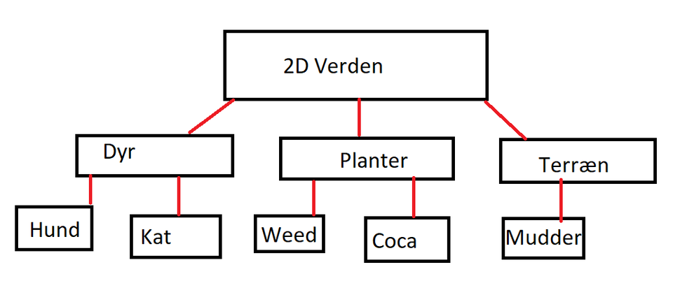
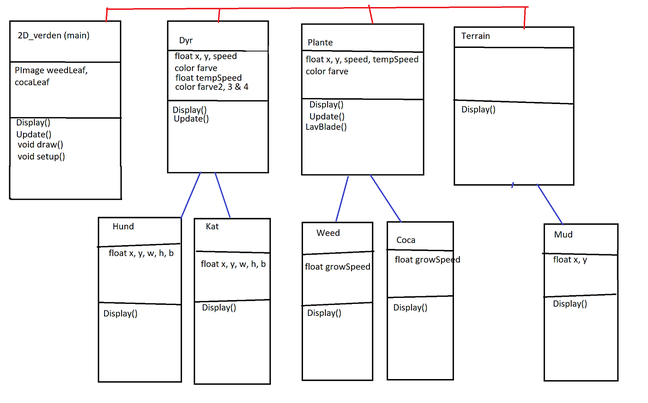

# sketch_2D_verden

Christopher Robin Heldgaard & Christopher Pontoppidan Bik, 2i KERM/IT
Programmering B Årsprøve Projekt									
H.C. Ørsted Gymnasium, Lyngby

<h1> 2D Verden </h1>

<h2> Objekt-Orienteret Analyse og Design </h2>

<h2>krav</h2>
-	Skal være objektorienteret   
-	Skal være 2D  
-	Skal have mindst 2 dyr, der kan bevæge sig  
-	Skal have mindst 2 planter, der kan vokse  
-	Skal have mindst 1 terræn, der har indflydelse på dyrenes hastighed  
  
<h2>Analyse</h2>
<h3>Ting liste</h3>
Hund - går langsomt rundt  
Kat - går hurtigt rundt  
Coca - vokser med cocablade  
Weed - vokser med weed blade  
Mudder - får hunde og katte til at gå langsommere   
 
<h3>Brugsscenarie</h3>
Bruger  
Tager mus hen til der, hvor der skal komme noget frem 
Trykker på henholdsvis knap 1, 2, 3, 4 eller 5  
Ser noget komme frem ved musen 

<h2>Design</h2>
Rollediagram  
 
Klassediagram  

